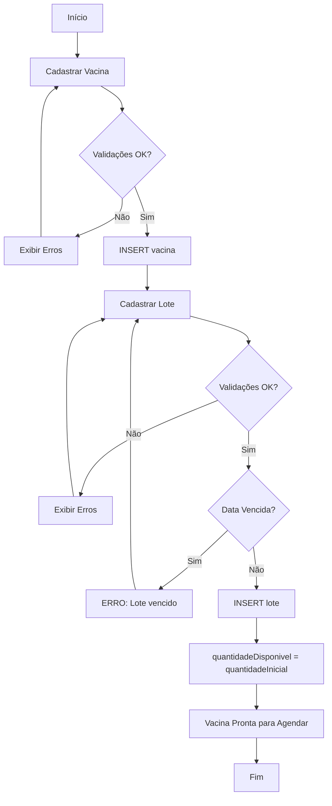
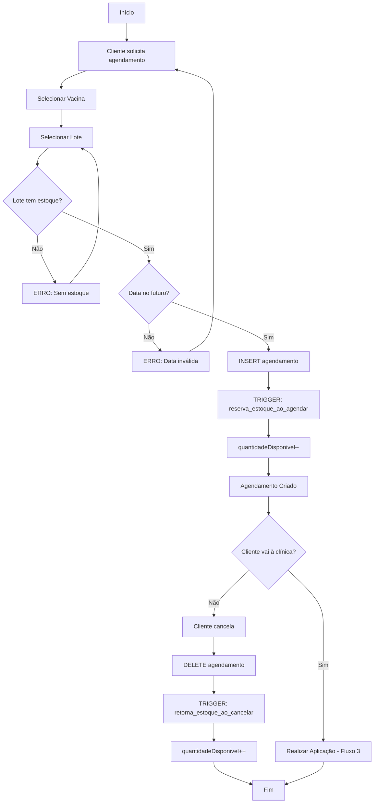
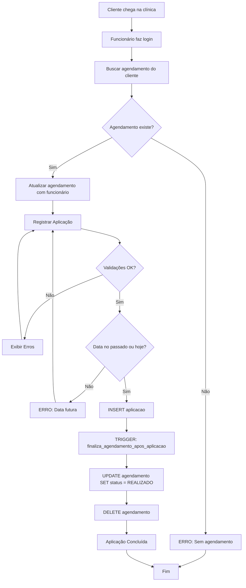
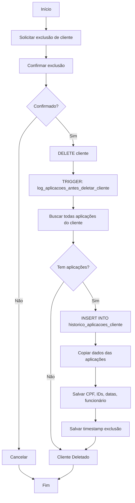
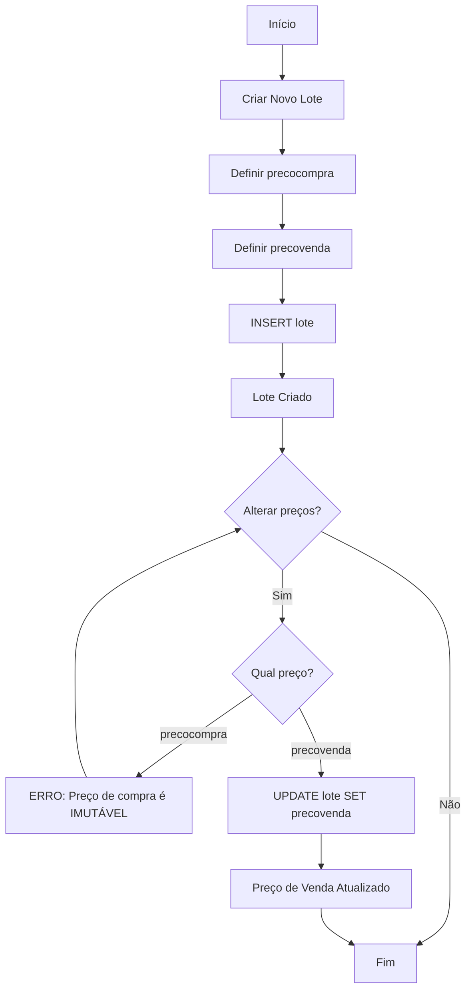

# 🧩 Lógica de Negócio - VixClinic

## 📋 Visão Geral

Este documento detalha **TODA** a lógica de negócio do sistema VixClinic, incluindo validações, regras, fluxos e suas equivalências em C# (FluentValidation).

## ✅ Validações de Dados

### Validação com Zod (TypeScript) → FluentValidation (C#)

**Arquivo TypeScript**: `src/lib/validations.ts`

---

### 1. Validação de CPF

#### Zod (TypeScript)
```typescript
export const cpfSchema = z
  .string()
  .regex(/^\d{11}$/, "CPF deve conter exatamente 11 dígitos numéricos");

// Formatador
export const formatCPF = (value: string): string => {
  return value.replace(/\D/g, '').substring(0, 11);
};

// Validador
export const validateCPF = (cpf: string): boolean => {
  return /^\d{11}$/.test(cpf);
};

// Display
export const displayCPF = (cpf: string): string => {
  if (!cpf || cpf.length !== 11) return cpf;
  return cpf.replace(/(\d{3})(\d{3})(\d{3})(\d{2})/, '$1.$2.$3-$4');
};
```

#### FluentValidation (C#)
```csharp
public class CpfValidator : AbstractValidator<string>
{
    public CpfValidator()
    {
        RuleFor(cpf => cpf)
            .NotEmpty().WithMessage("CPF é obrigatório")
            .Length(11).WithMessage("CPF deve conter exatamente 11 dígitos")
            .Matches(@"^\d{11}$").WithMessage("CPF deve conter apenas números");
    }
}

// Formatador
public static class CpfFormatter
{
    public static string Format(string cpf)
    {
        return Regex.Replace(cpf, @"\D", "").Substring(0, Math.Min(11, cpf.Length));
    }
    
    public static string Display(string cpf)
    {
        if (string.IsNullOrEmpty(cpf) || cpf.Length != 11)
            return cpf;
        
        return Regex.Replace(cpf, @"(\d{3})(\d{3})(\d{3})(\d{2})", "$1.$2.$3-$4");
    }
}
```

**Regras**:
- ✅ Exatamente 11 dígitos
- ✅ Apenas números (sem pontos, hífens)
- ✅ Armazenado sem formatação no banco
- ✅ Exibido com formatação (XXX.XXX.XXX-XX) na UI

---

### 2. Validação de Email

#### Zod (TypeScript)
```typescript
export const emailSchema = z
  .string()
  .min(1, "Email é obrigatório")
  .email("Email inválido");

// Validador
export const validateEmail = (email: string): boolean => {
  if (!email) return true;
  return z.string().email().safeParse(email).success;
};
```

#### FluentValidation (C#)
```csharp
public class EmailValidator : AbstractValidator<string>
{
    public EmailValidator()
    {
        RuleFor(email => email)
            .NotEmpty().WithMessage("Email é obrigatório")
            .EmailAddress().WithMessage("Email inválido");
    }
}
```

**Regras**:
- ✅ Formato de email válido
- ✅ Não pode ser vazio quando obrigatório
- ⚠️ Em `cliente`, email é OPCIONAL
- ✅ Em `funcionario`, email é OBRIGATÓRIO e ÚNICO

---

### 3. Validação de Telefone

#### Zod (TypeScript)
```typescript
export const telefoneSchema = z
  .string()
  .regex(/^\d{10,11}$/, "Telefone deve conter 10 ou 11 dígitos")
  .optional()
  .or(z.literal(''));

// Formatador
export const formatTelefone = (value: string): string => {
  return value.replace(/\D/g, '').substring(0, 11);
};

// Validador
export const validateTelefone = (telefone: string): boolean => {
  if (!telefone) return true;
  return /^\d{10,11}$/.test(telefone);
};

// Display
export const displayTelefone = (telefone: string): string => {
  if (!telefone) return '';
  
  if (telefone.length === 11) {
    // Celular: (XX) XXXXX-XXXX
    return telefone.replace(/(\d{2})(\d{5})(\d{4})/, '($1) $2-$3');
  } else if (telefone.length === 10) {
    // Fixo: (XX) XXXX-XXXX
    return telefone.replace(/(\d{2})(\d{4})(\d{4})/, '($1) $2-$3');
  }
  
  return telefone;
};
```

#### FluentValidation (C#)
```csharp
public class TelefoneValidator : AbstractValidator<string>
{
    public TelefoneValidator(bool isRequired = false)
    {
        if (isRequired)
        {
            RuleFor(tel => tel)
                .NotEmpty().WithMessage("Telefone é obrigatório");
        }
        
        When(tel => !string.IsNullOrEmpty(tel), () =>
        {
            RuleFor(tel => tel)
                .Length(10, 11).WithMessage("Telefone deve conter 10 ou 11 dígitos")
                .Matches(@"^\d{10,11}$").WithMessage("Telefone deve conter apenas números");
        });
    }
}

// Formatador
public static class TelefoneFormatter
{
    public static string Format(string telefone)
    {
        return Regex.Replace(telefone, @"\D", "").Substring(0, Math.Min(11, telefone.Length));
    }
    
    public static string Display(string telefone)
    {
        if (string.IsNullOrEmpty(telefone))
            return string.Empty;
        
        if (telefone.Length == 11)
            return Regex.Replace(telefone, @"(\d{2})(\d{5})(\d{4})", "($1) $2-$3");
        else if (telefone.Length == 10)
            return Regex.Replace(telefone, @"(\d{2})(\d{4})(\d{4})", "($1) $2-$3");
        
        return telefone;
    }
}
```

**Regras**:
- ✅ 10 dígitos (telefone fixo) ou 11 dígitos (celular)
- ✅ Apenas números (sem parênteses, hífens)
- ✅ Armazenado sem formatação
- ✅ Exibido formatado: `(XX) XXXXX-XXXX` ou `(XX) XXXX-XXXX`

---

### 4. Validação de Senha

#### Zod (TypeScript)
```typescript
export const senhaSchema = z
  .string()
  .min(8, "A senha deve ter no mínimo 8 caracteres");
```

#### FluentValidation (C#)
```csharp
public class SenhaValidator : AbstractValidator<string>
{
    public SenhaValidator()
    {
        RuleFor(senha => senha)
            .NotEmpty().WithMessage("Senha é obrigatória")
            .MinimumLength(8).WithMessage("A senha deve ter no mínimo 8 caracteres");
    }
}
```

**Regras**:
- ✅ Mínimo 8 caracteres
- ✅ Armazenada com hash bcrypt (10 rounds)
- ⚠️ Não há validação de complexidade (maiúsculas, números, símbolos) no sistema atual

**Hash de Senha**:

TypeScript:
```typescript
import bcrypt from 'bcryptjs';

export const hashPassword = async (password: string): Promise<string> => {
  const saltRounds = 10;
  return await bcrypt.hash(password, saltRounds);
};

export const verifyPassword = async (password: string, hash: string): Promise<boolean> => {
  return await bcrypt.compare(password, hash);
};
```

C#:
```csharp
using BCrypt.Net;

public static class PasswordHasher
{
    public static string HashPassword(string password)
    {
        return BCrypt.HashPassword(password, BCrypt.GenerateSalt(10));
    }
    
    public static bool VerifyPassword(string password, string hash)
    {
        return BCrypt.Verify(password, hash);
    }
}
```

---

### 5. Schema de Cliente

#### Zod (TypeScript)
```typescript
export const clienteSchema = z.object({
  CPF: cpfSchema,
  nomeCompleto: z.string().min(3, "Nome deve ter no mínimo 3 caracteres"),
  dataNasc: z.string().optional(),
  email: emailSchema.optional(),
  telefone: telefoneSchema,
  alergias: z.string().optional(),
  observacoes: z.string().optional(),
  status: z.enum(['ATIVO', 'INATIVO'])
});
```

#### FluentValidation (C#)
```csharp
public class ClienteValidator : AbstractValidator<ClienteDto>
{
    public ClienteValidator()
    {
        RuleFor(c => c.Cpf)
            .SetValidator(new CpfValidator());
        
        RuleFor(c => c.NomeCompleto)
            .NotEmpty().WithMessage("Nome é obrigatório")
            .MinimumLength(3).WithMessage("Nome deve ter no mínimo 3 caracteres")
            .MaximumLength(255).WithMessage("Nome deve ter no máximo 255 caracteres");
        
        When(c => !string.IsNullOrEmpty(c.DataNasc), () =>
        {
            RuleFor(c => c.DataNasc)
                .Must(BeAValidDate).WithMessage("Data de nascimento inválida")
                .Must(NotBeFutureDate).WithMessage("Data de nascimento não pode ser no futuro");
        });
        
        When(c => !string.IsNullOrEmpty(c.Email), () =>
        {
            RuleFor(c => c.Email)
                .SetValidator(new EmailValidator());
        });
        
        RuleFor(c => c.Telefone)
            .SetValidator(new TelefoneValidator(isRequired: false));
        
        RuleFor(c => c.Status)
            .IsInEnum().WithMessage("Status inválido");
    }
    
    private bool BeAValidDate(string dateString)
    {
        return DateTime.TryParse(dateString, out _);
    }
    
    private bool NotBeFutureDate(string dateString)
    {
        if (!DateTime.TryParse(dateString, out DateTime date))
            return true;
        
        return date <= DateTime.Today;
    }
}
```

---

### 6. Schema de Funcionário

#### Zod (TypeScript)
```typescript
export const funcionarioSchema = z.object({
  nomeCompleto: z.string().min(3, "Nome deve ter no mínimo 3 caracteres"),
  email: emailSchema,
  CPF: cpfSchema,
  telefone: telefoneSchema.optional(),
  cargo: z.string().optional(),
  senha: senhaSchema,
  status: z.enum(['ATIVO', 'INATIVO']),
  dataAdmissao: z.string().optional()
});
```

#### FluentValidation (C#)
```csharp
public class FuncionarioValidator : AbstractValidator<FuncionarioDto>
{
    public FuncionarioValidator()
    {
        RuleFor(f => f.NomeCompleto)
            .NotEmpty().WithMessage("Nome é obrigatório")
            .MinimumLength(3).WithMessage("Nome deve ter no mínimo 3 caracteres")
            .MaximumLength(255).WithMessage("Nome deve ter no máximo 255 caracteres");
        
        RuleFor(f => f.Email)
            .SetValidator(new EmailValidator());
        
        RuleFor(f => f.Cpf)
            .SetValidator(new CpfValidator());
        
        When(f => !string.IsNullOrEmpty(f.Telefone), () =>
        {
            RuleFor(f => f.Telefone)
                .SetValidator(new TelefoneValidator());
        });
        
        RuleFor(f => f.Senha)
            .SetValidator(new SenhaValidator());
        
        RuleFor(f => f.Status)
            .IsInEnum().WithMessage("Status inválido");
        
        When(f => !string.IsNullOrEmpty(f.DataAdmissao), () =>
        {
            RuleFor(f => f.DataAdmissao)
                .Must(BeAValidDate).WithMessage("Data de admissão inválida")
                .Must(NotBeFutureDate).WithMessage("Data de admissão não pode ser no futuro");
        });
    }
    
    private bool BeAValidDate(string dateString)
    {
        return DateTime.TryParse(dateString, out _);
    }
    
    private bool NotBeFutureDate(string dateString)
    {
        if (!DateTime.TryParse(dateString, out DateTime date))
            return true;
        
        return date <= DateTime.Today;
    }
}
```

---

### 7. Schema de Vacina

#### Zod (TypeScript)
```typescript
export const vacinaSchema = z.object({
  nome: z.string().min(2, "Nome deve ter no mínimo 2 caracteres"),
  fabricante: z.string().optional(),
  categoria: z.enum(['VIRAL', 'BACTERIANA', 'OUTRA']).optional(),
  quantidadeDoses: z.number().int().min(1, "Deve ter pelo menos 1 dose").optional(),
  intervaloDoses: z.number().int().min(0, "Intervalo não pode ser negativo").optional(),
  descricao: z.string().optional(),
  status: z.enum(['ATIVA', 'INATIVA'])
});
```

#### FluentValidation (C#)
```csharp
public class VacinaValidator : AbstractValidator<VacinaDto>
{
    public VacinaValidator()
    {
        RuleFor(v => v.Nome)
            .NotEmpty().WithMessage("Nome é obrigatório")
            .MinimumLength(2).WithMessage("Nome deve ter no mínimo 2 caracteres")
            .MaximumLength(255).WithMessage("Nome deve ter no máximo 255 caracteres");
        
        When(v => v.QuantidadeDoses.HasValue, () =>
        {
            RuleFor(v => v.QuantidadeDoses)
                .GreaterThan(0).WithMessage("Deve ter pelo menos 1 dose");
        });
        
        When(v => v.IntervaloDoses.HasValue, () =>
        {
            RuleFor(v => v.IntervaloDoses)
                .GreaterThanOrEqualTo(0).WithMessage("Intervalo não pode ser negativo");
        });
        
        RuleFor(v => v.Status)
            .IsInEnum().WithMessage("Status inválido");
        
        When(v => v.Categoria.HasValue, () =>
        {
            RuleFor(v => v.Categoria)
                .IsInEnum().WithMessage("Categoria inválida");
        });
    }
}
```

---

### 8. Schema de Lote

#### Zod (TypeScript)
```typescript
export const loteSchema = z.object({
  codigoLote: z.string().min(1, "Código do lote é obrigatório"),
  quantidadeInicial: z.number().int().min(1, "Quantidade deve ser maior que 0"),
  quantidadeDisponivel: z.number().int().min(0, "Quantidade não pode ser negativa"),
  dataValidade: z.string().min(1, "Data de validade é obrigatória"),
  Vacina_idVacina: z.number().int().min(1, "Vacina é obrigatória"),
  precocompra: z.number().min(0, "Preço de compra não pode ser negativo"),
  precovenda: z.number().min(0, "Preço de venda não pode ser negativo")
});
```

#### FluentValidation (C#)
```csharp
public class LoteValidator : AbstractValidator<LoteDto>
{
    public LoteValidator(bool isUpdate = false)
    {
        RuleFor(l => l.CodigoLote)
            .NotEmpty().WithMessage("Código do lote é obrigatório")
            .MaximumLength(100).WithMessage("Código deve ter no máximo 100 caracteres");
        
        RuleFor(l => l.QuantidadeInicial)
            .GreaterThan(0).WithMessage("Quantidade inicial deve ser maior que 0");
        
        RuleFor(l => l.QuantidadeDisponivel)
            .GreaterThanOrEqualTo(0).WithMessage("Quantidade disponível não pode ser negativa");
        
        RuleFor(l => l.DataValidade)
            .NotEmpty().WithMessage("Data de validade é obrigatória")
            .Must(BeAValidDate).WithMessage("Data de validade inválida")
            .Must(NotBeExpired).WithMessage("Lote não pode estar vencido");
        
        RuleFor(l => l.VacinaId)
            .GreaterThan(0).WithMessage("Vacina é obrigatória");
        
        // Preço de compra é IMUTÁVEL após criação
        if (!isUpdate)
        {
            RuleFor(l => l.PrecoCompra)
                .GreaterThanOrEqualTo(0).WithMessage("Preço de compra não pode ser negativo");
        }
        
        RuleFor(l => l.PrecoVenda)
            .GreaterThanOrEqualTo(0).WithMessage("Preço de venda não pode ser negativo");
    }
    
    private bool BeAValidDate(string dateString)
    {
        return DateTime.TryParse(dateString, out _);
    }
    
    private bool NotBeExpired(string dateString)
    {
        if (!DateTime.TryParse(dateString, out DateTime date))
            return true;
        
        return date >= DateTime.Today;
    }
}
```

**REGRA CRÍTICA**: `precocompra` é **IMUTÁVEL** após criação do lote. No UPDATE, este campo deve ser **IGNORADO** ou **VALIDADO** para não permitir alteração.

---

### 9. Schema de Agendamento

#### Zod (TypeScript)
```typescript
export const agendamentoSchema = z.object({
  dataAgendada: z.string().min(1, "Data é obrigatória"),
  observacoes: z.string().optional(),
  Cliente_CPF: cpfSchema,
  Funcionario_idFuncionario: z.number().int().optional(),
  Lote_numLote: z.number().int().min(1, "Lote é obrigatório")
});
```

#### FluentValidation (C#)
```csharp
public class AgendamentoValidator : AbstractValidator<AgendamentoDto>
{
    public AgendamentoValidator()
    {
        RuleFor(a => a.DataAgendada)
            .NotEmpty().WithMessage("Data é obrigatória")
            .Must(BeAValidDateTime).WithMessage("Data inválida")
            .Must(BeFutureDate).WithMessage("Data deve ser no futuro");
        
        RuleFor(a => a.ClienteCpf)
            .SetValidator(new CpfValidator());
        
        // Funcionário é OPCIONAL na criação
        When(a => a.FuncionarioId.HasValue, () =>
        {
            RuleFor(a => a.FuncionarioId)
                .GreaterThan(0).WithMessage("ID do funcionário inválido");
        });
        
        RuleFor(a => a.LoteNumLote)
            .GreaterThan(0).WithMessage("Lote é obrigatório");
    }
    
    private bool BeAValidDateTime(string dateString)
    {
        return DateTime.TryParse(dateString, out _);
    }
    
    private bool BeFutureDate(string dateString)
    {
        if (!DateTime.TryParse(dateString, out DateTime date))
            return true;
        
        return date > DateTime.Now;
    }
}
```

**REGRA CRÍTICA**: `funcionario_idfuncionario` é **NULLABLE** (opcional ao criar agendamento, obrigatório ao realizar aplicação).

---

### 10. Schema de Aplicação

#### Zod (TypeScript)
```typescript
export const aplicacaoSchema = z.object({
  dataAplicacao: z.string().min(1, "Data é obrigatória"),
  dose: z.number().int().min(1, "Dose deve ser maior que 0").optional(),
  reacoesAdversas: z.string().optional(),
  observacoes: z.string().optional(),
  Funcionario_idFuncionario: z.number().int().min(1, "Funcionário é obrigatório"),
  Cliente_CPF: cpfSchema,
  Agendamento_idAgendamento: z.number().int().optional()
});
```

#### FluentValidation (C#)
```csharp
public class AplicacaoValidator : AbstractValidator<AplicacaoDto>
{
    public AplicacaoValidator()
    {
        RuleFor(a => a.DataAplicacao)
            .NotEmpty().WithMessage("Data é obrigatória")
            .Must(BeAValidDate).WithMessage("Data inválida")
            .Must(NotBeFutureDate).WithMessage("Data não pode ser no futuro");
        
        When(a => a.Dose.HasValue, () =>
        {
            RuleFor(a => a.Dose)
                .GreaterThan(0).WithMessage("Dose deve ser maior que 0");
        });
        
        RuleFor(a => a.FuncionarioId)
            .GreaterThan(0).WithMessage("Funcionário é obrigatório");
        
        RuleFor(a => a.ClienteCpf)
            .SetValidator(new CpfValidator());
        
        When(a => a.AgendamentoId.HasValue, () =>
        {
            RuleFor(a => a.AgendamentoId)
                .GreaterThan(0).WithMessage("ID do agendamento inválido");
        });
    }
    
    private bool BeAValidDate(string dateString)
    {
        return DateTime.TryParse(dateString, out _);
    }
    
    private bool NotBeFutureDate(string dateString)
    {
        if (!DateTime.TryParse(dateString, out DateTime date))
            return true;
        
        return date <= DateTime.Today;
    }
}
```

---

## 🔄 Regras de Negócio Detalhadas

### 1. CLIENTE

#### Regras de Status
- **ATIVO**: Cliente pode ser agendado, receber vacinas
- **INATIVO**: Cliente não aparece em listas principais, mas histórico é mantido

#### Regras de Deleção
- ✅ Ao deletar cliente, todas as aplicações são copiadas para `historico_aplicacoes_cliente`
- ✅ Trigger `log_aplicacoes_antes_deletar_cliente()` é executado **BEFORE DELETE**
- ⚠️ Agendamentos futuros do cliente são **DELETADOS** (CASCADE)

#### Validações Adicionais
- Data de nascimento não pode ser no futuro
- CPF deve ser único no sistema
- Email é opcional, mas se fornecido deve ser válido

---

### 2. FUNCIONÁRIO

#### Regras de Autenticação
- Email é usado como **username** para login
- Senha é armazenada com **bcrypt hash** (10 rounds)
- Login via `supabase.auth.signInWithPassword()`

#### Regras de Status
- **ATIVO**: Pode fazer login e usar o sistema
- **INATIVO**: Não pode fazer login (bloqueado)

#### Regras de Permissões
- Atualmente não há sistema de roles implementado (RLS permite tudo com `true`)
- **RECOMENDADO**: Implementar tabela `user_roles` com roles (admin, vacinador, atendente)

#### Validações Adicionais
- Data de admissão não pode ser no futuro
- CPF deve ser único
- Email deve ser único
- Funcionários **NÃO PODEM SER DELETADOS** via API (apenas desativados)

---

### 3. VACINA

#### Regras de Categoria
- **VIRAL**: Vacinas contra vírus (ex: COVID-19, Gripe, Hepatite)
- **BACTERIANA**: Vacinas contra bactérias (ex: Tétano, Tuberculose)
- **OUTRA**: Outras categorias

#### Regras de Doses
- `quantidadeDoses`: Número de doses necessárias para imunização completa
- `intervaloDoses`: Dias mínimos entre doses (0 = dose única)

#### Regras de Status
- **ATIVA**: Disponível para criar lotes e agendar
- **INATIVA**: Não disponível (descontinuada, sem estoque)

#### Validações Adicionais
- Se `quantidadeDoses` > 1, `intervaloDoses` deve ser > 0
- Ao inativar vacina, lotes existentes **NÃO SÃO AFETADOS**

---

### 4. LOTE

#### Regras de Estoque
- `quantidadeInicial`: Quantidade total quando lote foi criado (IMUTÁVEL)
- `quantidadeDisponivel`: Quantidade atual disponível (DECREMENTADO a cada agendamento)

#### Controle de Estoque Automático
```
quantidadeDisponivel = quantidadeInicial - (agendamentos ativos)
```

#### Fluxo de Estoque:
1. **Criar Lote**: `quantidadeDisponivel = quantidadeInicial`
2. **Criar Agendamento**: `quantidadeDisponivel--` (trigger `reserva_estoque_ao_agendar`)
3. **Cancelar Agendamento**: `quantidadeDisponivel++` (trigger `retorna_estoque_ao_cancelar`)
4. **Realizar Aplicação**: Estoque **NÃO É DEVOLVIDO** (vacina foi usada)

#### Regras de Preço
- **`precocompra`**: Preço de aquisição do lote
  - ✅ Definido na **CRIAÇÃO** do lote
  - ❌ **IMUTÁVEL** - NÃO pode ser alterado depois
  - 💡 Usado para cálculo de lucro/prejuízo
  
- **`precovenda`**: Preço cobrado do cliente
  - ✅ Definido na **CRIAÇÃO** do lote
  - ✅ **EDITÁVEL** - PODE ser alterado a qualquer momento
  - 💡 Permite ajustes de preço conforme mercado

#### Regras de Validade
- `dataValidade`: Data de expiração do lote
- ❌ **NÃO PODE** estar vencida ao criar/atualizar lote (trigger `valida_lote`)
- ⚠️ Lotes com validade próxima (30 dias) aparecem em "Lotes Vencendo" no dashboard

#### Validações Adicionais
- Código do lote deve ser **ÚNICO** no sistema
- `quantidadeDisponivel` **NUNCA** pode ser negativa
- `quantidadeDisponivel` **NUNCA** pode ser maior que `quantidadeInicial`
- Ao deletar vacina, lotes relacionados são **DELETADOS** (CASCADE)

---

### 5. AGENDAMENTO

#### Estados do Agendamento
- **AGENDADO**: Criado, aguardando realização
- **REALIZADO**: Vacina foi aplicada (estado temporário, registro é deletado logo após)

#### Regras de Data
- Data agendada **DEVE SER NO FUTURO** (trigger `valida_agendamento`)
- Não há validação de horário de funcionamento da clínica (implementar se necessário)

#### Regras de Funcionário
- `funcionario_idfuncionario` é **NULLABLE**
- ✅ **OPCIONAL** ao criar agendamento (cliente pode agendar sozinho)
- ✅ **OBRIGATÓRIO** ao realizar aplicação (precisa saber quem aplicou)

#### Fluxo Completo:
```
1. Cliente agenda → INSERT agendamento (funcionario = NULL)
   └─> TRIGGER: reserva_estoque_ao_agendar() → quantidadeDisponivel--

2. Cliente chega na clínica → UPDATE agendamento SET funcionario = X

3. Funcionário aplica vacina → INSERT aplicacao
   └─> TRIGGER: finaliza_agendamento_apos_aplicacao()
       ├─> UPDATE agendamento SET status = 'REALIZADO'
       └─> DELETE agendamento (registro é removido)

4. Cliente cancela → DELETE agendamento
   └─> TRIGGER: retorna_estoque_ao_cancelar() → quantidadeDisponivel++
```

#### Validações Adicionais
- Lote deve ter estoque disponível (`quantidadeDisponivel > 0`)
- Cliente deve existir e estar ATIVO
- Lote deve estar dentro da validade

---

### 6. APLICAÇÃO

#### Regras de Data
- Data de aplicação **NÃO PODE SER NO FUTURO** (trigger `valida_aplicacao`)
- Data pode ser no passado (registrar aplicações atrasadas)

#### Regras de Dose
- `dose`: Número da dose (1ª, 2ª, 3ª, etc.)
- **OPCIONAL** (nem sempre é rastreado qual dose foi aplicada)
- Validação de intervalo entre doses **NÃO É AUTOMÁTICA** (implementar se necessário)

#### Regras de Reações Adversas
- `reacoesAdversas`: Campo de texto livre
- Importante para rastreamento de eventos adversos
- **OPCIONAL** (maioria das aplicações não tem reações)

#### Impacto no Agendamento
- Ao criar aplicação com `agendamento_idagendamento`:
  1. Trigger `finaliza_agendamento_apos_aplicacao()` é executado
  2. Agendamento é marcado como 'REALIZADO'
  3. Agendamento é **DELETADO** do banco
  4. Estoque **NÃO É DEVOLVIDO** (vacina foi usada)

#### Validações Adicionais
- Funcionário deve existir e estar ATIVO
- Cliente deve existir
- Se `agendamento_idagendamento` fornecido, agendamento deve existir e estar AGENDADO

---

## 📊 Fluxos de Negócio Completos

### Fluxo 1: Cadastro Completo de Vacina



### Fluxo 2: Agendamento de Vacinação



### Fluxo 3: Aplicação de Vacina



### Fluxo 4: Exclusão de Cliente com Histórico



### Fluxo 5: Gestão de Preços de Lote



---

## 🎯 Regras Especiais e Casos de Uso

### 1. Controle de Estoque Automático

**Problema**: Evitar overbooking de vacinas.

**Solução**:
- Estoque é reservado **imediatamente** ao criar agendamento
- Se agendamento for cancelado, estoque é **devolvido**
- Se vacina for aplicada, estoque **NÃO é devolvido** (foi consumida)

**Implementação**:
```sql
-- Ao criar agendamento
CREATE TRIGGER trg_reserva_estoque
AFTER INSERT ON agendamento
FOR EACH ROW
EXECUTE FUNCTION reserva_estoque_ao_agendar();
-- Decrementa quantidadeDisponivel

-- Ao cancelar agendamento
CREATE TRIGGER trg_retorna_estoque
BEFORE DELETE ON agendamento
FOR EACH ROW
EXECUTE FUNCTION retorna_estoque_ao_cancelar();
-- Incrementa quantidadeDisponivel SE status = 'AGENDADO'

-- Ao aplicar vacina
-- Agendamento é deletado, mas estoque NÃO é devolvido
```

---

### 2. Histórico de Aplicações após Exclusão

**Problema**: Cliente pode ser excluído, mas histórico médico precisa ser mantido por lei.

**Solução**:
- Antes de deletar cliente, todas as aplicações são copiadas para `historico_aplicacoes_cliente`
- Tabela de histórico **NÃO TEM FOREIGN KEYS** (cliente não existe mais)
- CPF é armazenado como texto para referência

**Implementação**:
```sql
CREATE TRIGGER trg_log_aplicacoes
BEFORE DELETE ON cliente
FOR EACH ROW
EXECUTE FUNCTION log_aplicacoes_antes_deletar_cliente();
-- Copia aplicações para historico ANTES de deletar
```

---

### 3. Preço de Compra Imutável

**Problema**: Preço de compra do lote não deve mudar após criação (auditoria, cálculo de lucro).

**Solução Frontend**:
```typescript
// BatchForm.tsx
<Input
  id="precocompra"
  type="number"
  step="0.01"
  {...register("precocompra", { valueAsNumber: true })}
  disabled={!!batch} // DISABLED ao editar
/>
```

**Solução Backend (C#)**:
```csharp
// Controller
[HttpPut("lotes/{id}")]
public async Task<IActionResult> UpdateLote(int id, LoteDto loteDto)
{
    var existingLote = await _context.Lotes.FindAsync(id);
    
    // NUNCA atualizar precocompra
    loteDto.PrecoCompra = existingLote.PrecoCompra;
    
    // Atualizar resto dos campos
    _mapper.Map(loteDto, existingLote);
    await _context.SaveChangesAsync();
    
    return Ok(existingLote);
}
```

---

### 4. Funcionário Opcional no Agendamento

**Problema**: Cliente pode agendar online, mas funcionário só é definido na hora da aplicação.

**Solução**:
- Campo `funcionario_idfuncionario` é **NULLABLE** na tabela `agendamento`
- Frontend **NÃO EXIBE** campo de funcionário no formulário de agendamento
- Funcionário é definido automaticamente ao registrar aplicação

**Fluxo**:
```typescript
// 1. Criar agendamento (frontend)
const agendamento = {
  dataAgendada: "2025-10-15 10:00",
  Cliente_CPF: "12345678901",
  Lote_numLote: 5,
  Funcionario_idFuncionario: null // NULLABLE
};

// 2. Registrar aplicação (frontend)
const aplicacao = {
  dataAplicacao: "2025-10-15",
  Cliente_CPF: "12345678901",
  Funcionario_idFuncionario: currentUser.id, // Do usuário logado
  Agendamento_idAgendamento: 123
};
// Trigger finaliza o agendamento automaticamente
```

---

## 🔍 Casos de Erro e Validações

### Erros de Validação Comuns

#### 1. CPF Inválido
```
Erro: "CPF deve conter exatamente 11 dígitos numéricos"
Causa: CPF com formatação (pontos/hífens) ou menos de 11 dígitos
Solução: Remover formatação com formatCPF() antes de salvar
```

#### 2. Data de Nascimento no Futuro
```
Erro: "A data de nascimento não pode ser uma data futura."
Causa: Trigger valida_cliente() detectou dataNasc > CURRENT_DATE
Solução: Selecionar data passada ou deixar em branco
```

#### 3. Estoque Insuficiente
```
Erro: "Não há vacinas disponíveis neste lote para agendamento."
Causa: Trigger reserva_estoque_ao_agendar() detectou quantidadeDisponivel <= 0
Solução: Escolher outro lote ou criar novo lote
```

#### 4. Agendamento no Passado
```
Erro: "A data do agendamento deve ser no futuro."
Causa: Trigger valida_agendamento() detectou dataAgendada <= NOW()
Solução: Selecionar data futura
```

#### 5. Lote Vencido
```
Erro: "A data de validade não pode ser anterior à data atual. Lote vencido."
Causa: Trigger valida_lote() detectou dataValidade < CURRENT_DATE
Solução: Informar data de validade futura
```

#### 6. Preço de Compra Alterado
```
Erro: "Preço de compra é imutável e não pode ser alterado."
Causa: Tentativa de UPDATE do campo precocompra
Solução: Não permitir edição do campo no frontend
```

---

## 📝 Checklist de Implementação em C#

### Backend (ASP.NET Core)

- [ ] Criar classes de modelo (POCOs) para todas as 7 entidades
- [ ] Configurar Entity Framework Core com PostgreSQL
- [ ] Criar DbContext com todas as tabelas
- [ ] Implementar FluentValidation para todos os DTOs
- [ ] Criar serviço de hash de senha (BCrypt.Net)
- [ ] Implementar repositórios para cada entidade
- [ ] Criar serviços de negócio para lógica complexa
- [ ] Implementar triggers como stored procedures no PostgreSQL
- [ ] Configurar autenticação JWT
- [ ] Criar controllers para todos os endpoints
- [ ] Implementar sistema de roles (user_roles table)
- [ ] Configurar AutoMapper para DTOs
- [ ] Adicionar logging (Serilog)
- [ ] Criar testes unitários para validações
- [ ] Criar testes de integração para fluxos principais

### Banco de Dados

- [ ] Executar script de criação de tabelas
- [ ] Criar todos os triggers e funções
- [ ] Configurar índices para performance
- [ ] Implementar RLS policies melhoradas
- [ ] Criar stored procedures para operações complexas
- [ ] Configurar backup automático

### Validações Críticas

- [ ] CPF: 11 dígitos numéricos, único
- [ ] Email: formato válido, único em funcionario
- [ ] Telefone: 10-11 dígitos numéricos
- [ ] Senha: mínimo 8 caracteres, hash bcrypt
- [ ] Datas: nascimento e admissão não futuras
- [ ] Datas: agendamento futura, aplicação passada
- [ ] Estoque: não negativo, reservado ao agendar
- [ ] Preço de compra: imutável após criação
- [ ] Lote: data de validade não vencida

---

**Documento gerado em**: 2025-10-14  
**Versão do Sistema**: 1.0.0
